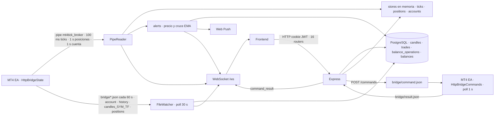
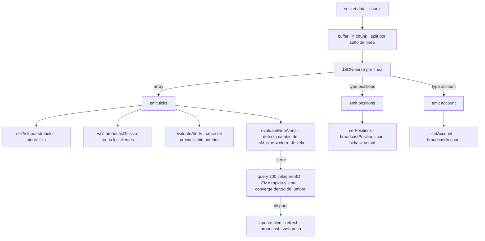
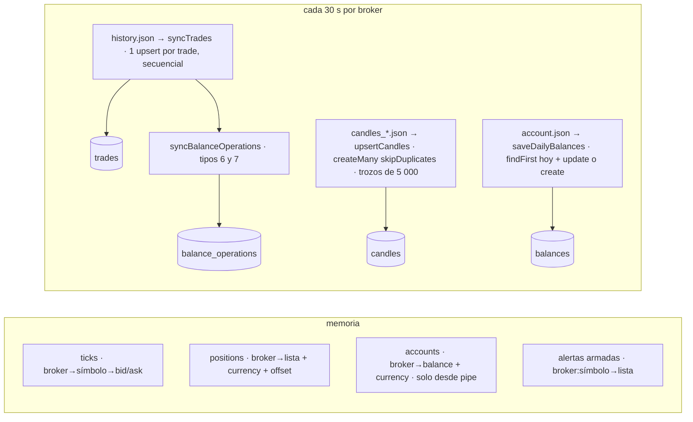
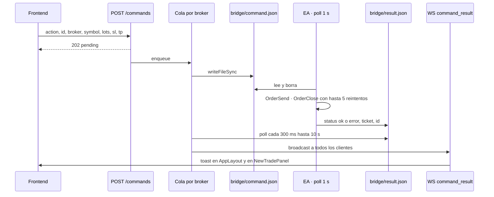

# Backend — Estado, diagnóstico y plan de mejora

> 30/09/2026 · `master` @ `d1027ac` · Revisión de solo lectura: 44 archivos TS, 2 801 líneas, 24 migraciones Prisma, sin ejecutar build ni tests (no hay tests) · 1 SP = 1 h de desarrollador senior.
> Documento único. Cada mejora explicada sin tecnicismos: [mejoras explicadas](2026-09-30-backend-explained.md).

---

## Parte I — Cómo funciona hoy

### 1. De dónde vienen los datos y a dónde van



Un proceso Node (pm2, VPS Windows) arranca **un `PipeReader` y un `FileWatcher` por broker** (`src/index.ts:26-84`). Config en `brokers.json` (`config.ts:14-26`) y flags `FEATURE_PIPE/WATCHER/ALERTS/WS_BROADCAST` que solo se apagan con el valor literal `false` (`config.ts:28`).

**El pipe transporta tres tipos de línea**, no dos: array = batch de ticks; `{type:"positions"}`; `{type:"account"}` cada segundo (`pipe-reader.ts:44-51`, EA `HttpBridgeState.mq4:300-304`). Cualquier otra forma se descarta en silencio.

**El FileWatcher lee cada 30 s** `account.json`, `history.json` y todos los `candles_*.json` con `readFileSync` + `JSON.parse` (`file-watcher.ts:63-110`). El EA los escribe cada 60 s, así que la mitad de las lecturas son redundantes. `positions.json` **lo escribe el EA pero nadie lo lee** (`mq4:311`; el watcher solo abre tres tipos de archivo).

### 2. Ciclo de un tick



Todo el manejo es síncrono dentro del handler del socket (`pipe-reader.ts:35-56`); el `try` envuelve también los `emit`, por lo que una excepción en un listener se registra como "Failed to parse pipe message" y la línea nunca se muestra. El buffer no tiene tope.

### 3. Ciclo de una petición HTTP

`app.ts` monta CORS (regex `\.amfxtrading\.com(:\d+)?$`, `app.ts:24`), `express.json()`, `cookie-parser`, y 16 routers, todos tras `requireAuth` salvo `/auth` y `/health`. `requireAuth` verifica el JWT de la cookie `token` y deja `req.userId` (`middleware/requireAuth.ts`). **No hay middleware de error ni envoltorio async**: cada handler es `async (req, res) => { ... await db... }` sin `try`. Las rutas hablan con Prisma directamente (26 importadores de `db/client`; no hay capa de servicios salvo `stats`, `scanner`, `sizing` y los syncs).

Recursos por usuario (alertas, dibujos, indicadores, suscripciones push) filtran por `userId` en lectura, edición y borrado (`routes/alerts.ts:28,57,84`, `ema-alerts.ts:34,66,96`, `drawings.ts`, `chart-indicators.ts`). Recursos **globales**: `settings_mirror` y `settings_display`, colores de posiciones, trades, balances y `/commands` — cualquier usuario autenticado opera cualquier broker. Con un solo usuario (confirmado) es aceptable; queda anotado por si entra otro.

### 4. Estado, sincronización y BD



- El guard `polling` del watcher solo cubre las velas: `emit('history')` y `emit('account')` disparan handlers `async` que nadie espera (`file-watcher.ts:70-72`, `index.ts:62,71`). Si un sync tarda más de 30 s, el siguiente se solapa.
- `saveDailyBalances` es *check-then-act* sin clave única (`services/account.ts:8-25`): dos llamadas solapadas para el **mismo broker** en la primera escritura del día crean dos filas. Es el origen del duplicado conocido; no puede venir de dos brokers distintos (la query filtra por `broker`).
- Los syncs de trades son insert-only (`update: {}`) ejecutados como N upserts secuenciales; equivalen a un `createMany({skipDuplicates})`.
- La cuenta llega por dos vías con distinto destino: el pipe (cada 1 s) actualiza el store y emite por WS; el archivo (cada 30 s, con hasta 90 s de antigüedad) persiste y **también emite por WS**, así que el balance puede "retroceder" un instante en la UI (`index.ts:51-55` vs `71-76`).

### 5. Las tres convenciones de tiempo

| Dato | Origen | Cómo se guarda | Consecuencia |
|---|---|---|---|
| `candles.time` | `iTime` = **apertura** en reloj del broker (`mq4:446`) | `new Date(t*1000)` sin restar `brokerOffset` (`services/candles.ts:20`) | Hora broker etiquetada como UTC (+1 h/+2 h). El frontend compensa con `DISPLAY_TIME_SHIFT_SEC = 3600` fijo (`LightweightChart.tsx:44`), que solo es correcto mientras el offset del broker sea 1 h |
| `trades.openTime/closeTime` | `"yyyy.mm.dd hh:mi"` en reloj del broker (`mq4:412`) | `new Date(str)` → **zona horaria del servidor Node** (`services/trades.ts:15`) | Desfase = offset broker − offset servidor (p. ej. FTMO GMT+3 vs Madrid GMT+2 = 1 h). `daily-pnl` calcula la medianoche broker en UTC real (`routes/balances.ts:25-31`) y la compara con esto: ventana desplazada |
| `balances.timestamp` | `now()` de PostgreSQL | `today` = medianoche **local del servidor** (`account.ts:5-6`) | Tercera convención; `timestamp` nunca se actualiza en el `update` pero `stats.ts:127` lo usa como ancla |

Nota: la memoria de trabajo del proyecto decía "BD guarda el cierre de la vela"; era una lectura errónea del desfase de +1 h. Se ha corregido.

### 6. El mecanismo más arriesgado: el camino de una orden



Lo que sí protege: cola por broker (`commands.ts:17-24`), id por comando, borrado de `result.json` al consumirlo. Lo que no:

- Se valida solo que existan `action`, `id`, `broker`, `symbol` (`commands.ts:69`). `action` no se contrasta con la lista; `lots`, `sl`, `tp`, `price`, `ticket` no se tipan. Una `action` desconocida la consume el EA sin escribir resultado → timeout de 10 s.
- **Un timeout no significa que la orden no se ejecutó.** Un cierre con reintentos o un `OrderSend` lento puede superar los 10 s; el usuario ve "No response from EA", el EA ejecuta, y el `result.json` tardío se ignora porque el id ya no coincide (`commands.ts:42`). Invita a repetir la orden. El EA escribe `pending.json` (`HttpBridgeCommands.mq4:171-180`) que el backend no lee.
- El mensaje de error del EA (`"ticket not found"`) se descarta; solo se lee `code` (`commands.ts:129`).
- `writeFileSync` no es atómico: el EA puede leer un archivo a medias.
- **Sizing por riesgo** (`services/sizing.ts`): pip = 0,0001 salvo JPY, contrato fijo 100 000, moneda cotizada = últimos 3 caracteres (`EURUSD.r` → `D.r`), distancia al SL medida desde el **bid actual también para órdenes pendientes** (`commands.ts:101`), y si no hay par de conversión asume 1:1 sin avisar (`sizing.ts:41`). Correcto para forex sin sufijo con conversión disponible; silenciosamente incorrecto para el resto.
- `magic` nunca se envía; toda orden sale con magic 0 (`commands.ts:107-112`).

### 7. WebSocket, sesión y apagado

- La autenticación del WS ocurre **después** del upgrade, en `connection`, con `close(1008)` (`ws/ws.ts:23-27`). No se comprueba `Origin`; con la cookie `SameSite=None` (`auth.ts:13`) cualquier web abierta en el navegador del usuario puede abrir `/ws` y leer ticks, posiciones, cuenta y alertas (*cross-site WebSocket hijacking*). Sin ping/pong ni control de `bufferedAmount`: un cliente medio muerto acumula buffer sin límite.
- Todos los clientes reciben todo: todos los brokers, todos los `command_result`, y las alertas de **todos** los usuarios con su `userId` (`ws.ts:58-63`); el frontend filtra. `ema_alert` se emite pero ningún código del frontend lo escucha.
- **Logout no cierra sesión** (confirmado en producción): `res.clearCookie('token')` sin `domain` (`auth.ts:44`) borra una cookie host-only que no existe; la de `.amfxtrading.com` sobrevive 7 días y `/auth/me` vuelve a entrar al recargar.
- Login sin límite de intentos; el email desconocido responde antes del `bcrypt.compare` (oráculo por tiempo, menor).
- `SIGTERM` cierra pipes y watcher, desconecta la BD **antes** de cerrar el HTTP y no cierra el WSS ni los intervalos de `waitForResult` (`index.ts:112-116`). En Windows con pm2 lo normal es que este camino ni se ejecute.

### 8. Despliegue

`deploy-backend.yml` → SCP de `deploy.ps1` → SSH. Sin instalar, tipar ni compilar en CI. En el VPS (`scripts/deploy.ps1`): `git reset --hard` + `git clean -fd` (sin `-x`: `brokers.json` y `.env` sobreviven) + `pull` → **`pm2 delete`** → liberar puerto 3000 → `npm install` → `prisma generate` → **`prisma migrate deploy`** → `npm run build` → `pm2 start` → `pm2 save`. Si `tsc` falla: el servicio ya está parado, las migraciones ya aplicadas, `dist/` parcialmente sobrescrito (sin `noEmitOnError`), y el script no lo detecta ni hace *health check*. El watchdog (`infra/scripts/startup.ps1:47-60`) haría `pm2 resurrect` a los 5 min sobre ese `dist` a medias.

---

## Parte II — Diagnóstico

**A. Cualquier petición mal formada tumba el proceso entero.** Express 4 no captura promesas rechazadas, no hay middleware de error ni `process.on('unhandledRejection')`, y Node ≥ 15 (24 en desarrollo) termina el proceso ante un rechazo sin manejar. `GET /trades?limit=abc` (`take: NaN`, `routes/trades.ts:23`), `?from=x` (Invalid Date), `/candles?before=x`, `PUT /chart-indicators` sin `emas`, o cualquier hipo de la BD durante una petición, reinician el backend con sus 10 brokers, sus stores, sus alertas armadas y su cola de comandos. El usuario confirma reinicios esporádicos en producción.

**B. Tres convenciones de tiempo conviven y ninguna es UTC.** Velas en hora broker etiquetada como UTC, trades en hora broker interpretada en la zona del servidor, balances en medianoche local del servidor (Parte I §5). Lo compensan parches en el frontend (shift fijo de 1 h, regex por campo). Funciona mientras el broker sea GMT+1 sin DST y el servidor no cambie de zona; cualquier broker nuevo, cambio de horario o migración de VPS mueve las estadísticas diarias y el gráfico.

**C. El despliegue para el servicio antes de saber si compila.** Sin gate en CI, migraciones antes del build, sin rollback ni comprobación posterior. La probabilidad de fallo es baja (el build se prueba en local), pero el coste es una caída hasta intervención manual — y ya ha ocurrido un incidente de pull concurrente.

**D. La sesión y el WS confían en cosas que no comprueban.** Logout inoperante (confirmado), WS sin `Origin` ni auth previa al upgrade, sin heartbeat, sin límite de intentos de login. Con un único usuario el daño potencial es bajo, pero son cuatro arreglos de una tarde.

**E. El sync de 30 s hace trabajo redundante y sin serializar.** ~50 upserts secuenciales de trades por broker (miles en arranque), 75 `createMany` de ~100 filas por broker cada 30 s para insertar ~1 fila nueva, lecturas síncronas que bloquean el event loop de todos los brokers, handlers no esperados que se solapan y producen el duplicado de `balances`. Sin índice `(broker, closeTime)` aunque todas las queries de trades lo usan; `/candles/emas` carga el histórico completo (~10⁵ filas M5) en cada apertura de gráfico (`routes/candles.ts:24-33`).

**F. El camino de órdenes reporta timeouts que no lo son y dimensiona con supuestos forex.** Parte I §6. Es el único punto donde un error cuesta dinero real.

**G. Documentación y herramientas desactualizadas.** `.claude/CLAUDE.md` (que lee cada sesión) describe `positions.json`/`syncPositions`, un modelo `Position`, un campo `magic`, dos tipos de mensaje de pipe, y 250 líneas de un engine eliminado en la spec 001; `backend/docs/architecture.md` cita `ws/ticks.ts`, `services/positions.ts`, env vars `BRIDGE_PATH`/`BROKER_NAME` que no existen. Sin ESLint, Prettier, tests, `engines`, ni scripts `lint/test/typecheck`. ~130 líneas muertas en `indicators/ema-cross.ts` (pivotes, weak/strong) que se ejecutan en cada llamada del scanner y se descartan.

---

## Parte III — Qué proponemos

### 9. Mejoras, en orden de valor por hora

| Código | Mejora | Qué resuelve | SP | Spec |
|---|---|---|---|---|
| BE-01 | Frontera de errores: envoltorio async + middleware final + `unhandledRejection` logueado; validación de `limit/offset/from/to/before/after`, `ticket`, PUT de alertas, `PUT /settings` | A | 4 | 004 ✅ |
| BE-02 | Logout con las mismas opciones de cookie; `bcrypt.compare` ficticio para email desconocido; límite de intentos de login en memoria | D | 2 | 005 ✅ |
| BE-03 | Deploy seguro: `tsc --noEmit` en CI y en el VPS **antes** de `pm2 delete`; `noEmitOnError`; limpiar `dist`; `/health` tras `pm2 start`; config pm2 compartida con `startup.ps1` | C | 4 | 005 ✅ |
| BE-04 | Balance diario: columna `day` + `@@unique([broker, day])` + `upsert` + limpieza de duplicados; el watcher espera los handlers de `history` y `account`; trades y operaciones con `createMany({skipDuplicates})`; saltar archivos sin cambio de `mtime` | E | 5 | 007 ⏳ |
| BE-05 | WS: comprobar `Origin` y JWT antes del upgrade (`verifyClient`); ping/pong 30 s; cortar clientes con `bufferedAmount` alto; `userId` por socket y alertas solo a su dueño | D | 4 | — |
| BE-06 | Comandos: whitelist de `action`, `lots` finito > 0, `ticket` numérico, charset de `id`; escritura `tmp` + `rename`; pasar `message` del EA; leer `pending.json` para extender la espera; loguear resultados tardíos con su id | F | 4 | — |
| BE-07 | Sizing: precio de referencia = `price` en órdenes pendientes; 400 si no hay par de conversión; `getPipSize` compartido; nota explícita de que solo cubre forex | F | 2 | — |
| BE-08 | Vitalidad por broker: reintento de `listen` del pipe con backoff; `lastMessageAt` por broker; `/health` con brokers y antigüedad; loguear el `readdir` fallido del watcher y el `syncColors` silenciado | A, E | 3 | — |
| BE-09 | `/candles/emas` con calentamiento acotado (p. ej. 10 × periodo lento antes de `from`); índice `(broker, closeTime)`; quitar índice redundante de `drawings`; migración que alinee nombres heredados (`account_snapshots_*`, `trendlines_*`) | E | 2 | — |
| BE-10 | Docs y código muerto: reescribir la sección backend de `CLAUDE.md` y `docs/architecture.md`, borrar las secciones de engine; podar `ema-cross.ts`, `scanner.ts:78-79`, exports sin uso; `.env.example` con `JWT_SECRET` y `VAPID_*` | G | 3 | — |
| BE-11 | Base de herramientas: ESLint + Prettier (config del frontend), Vitest, scripts `lint/typecheck/test`, `engines` + `.nvmrc`, `noUnusedLocals/Parameters`; primeros tests puros: `ema.ts`, `ema-cross.ts`, `stats.ts`, `sizing.ts` | G, base de todo lo demás | 5 | 008 ⏳ |

**Bloque recomendado (esta semana): BE-01 + BE-02 + BE-03 + BE-04 = 15 SP (~2 días).** Ataca el crash confirmado, el logout confirmado, el riesgo de caída en deploy y el duplicado conocido. Condición: revisar cada spec en producción con `pm2 list` (contador de restarts) antes y después.

**Segundo bloque: BE-05 … BE-09 = 15 SP.** Cierra WS, órdenes y observabilidad.

**Tercero: BE-10 + BE-11 = 8 SP**, oportunistas — 11 conviene hacerlo *antes* del segundo bloque si se quiere tests sobre sizing y stats.

Total 1–11: **38 SP**.

### 10. Refactors clave

#### 10.1 Frontera de errores (mejora 1)

```ts
// middleware/asyncRoute.ts
export const asyncRoute = (fn: (req, res, next) => Promise<void>) =>
  (req, res, next) => { fn(req, res, next).catch(next); };

// middleware/parse.ts
export const intParam = (v: unknown, def: number, max: number): number | null => { ... NaN → null };
export const dateParam = (v: unknown): Date | null | undefined => { ... };

// app.ts (al final)
app.use((err, req, res, _next) => {
  console.error('[HTTP]', req.method, req.path, err);
  if (res.headersSent) return;
  res.status(err.status ?? 500).json({ error: err.status ? err.message : 'Internal error' });
});

// index.ts
process.on('unhandledRejection', (r) => console.error('[UNHANDLED]', r));
```

Pasos sin romper nada: (1) añadir middleware y `unhandledRejection` — comportamiento idéntico salvo que ya no muere; (2) envolver rutas una a una con `asyncRoute`; (3) sustituir cada `parseInt`/`new Date` por los helpers devolviendo 400; (4) cuando Express 5 entre (fuera de este plan), `asyncRoute` desaparece sin tocar las rutas. Cierre: `curl` con `limit=abc`, `from=x`, cuerpo vacío en PUT → 400, proceso vivo.

#### 10.2 Sync serializado y sin duplicados (mejora 4)

```prisma
model Balance {
  ...
  day  DateTime @db.Date
  @@unique([broker, day])
}
```

```ts
// file-watcher.ts: mismo patrón que onCandles
onAccount(handler); onHistory(handler);
private async poll() {
  if (this.polling) return; this.polling = true;
  try { await account; await history; await this.readCandles(); } finally { this.polling = false; }
}
// services/account.ts
await db.balance.upsert({ where: { broker_day: { broker, day } }, create: {...data, day, timestamp: now}, update: {...data, timestamp: now} });
```

Pasos: (1) migración: añadir `day` nullable, rellenar `day = date(timestamp)`, borrar duplicados conservando el `id` mayor por `(broker, day)`, poner `NOT NULL` + unique; (2) cambiar `saveDailyBalances`; (3) cambiar el watcher a callbacks esperados; (4) `syncTrades`/`syncBalanceOperations` → `createMany`. Decidir en la spec si `day` es día UTC o día broker (hoy es medianoche del servidor); el cambio es de una línea.

### 11. Qué no proponemos ahora, y qué lo haría entrar

| Qué | SP | Por qué no ahora | Entra cuando |
|---|---|---|---|
| Unificar los tiempos a UTC aplicando `brokerOffset` (velas, trades, balances, front sin shift fijo) | 16 | Cambia datos guardados y todos los consumidores (chart, stats, daily-pnl, alertas EMA); necesita decisión de producto y backfill | Se añada un broker con otro huso, cambie el DST y descuadre el gráfico, o se migre el VPS de zona |
| Clave primaria `(broker, ticket)` en trades y operaciones | 4 | Hoy los brokers no colisionan; migración de PK | Dos brokers del mismo servidor MT4 |
| Logger con niveles (pino) y log de peticiones | 3 | Los `console.*` con prefijo bastan para un proceso | Haya más de un proceso o se quiera correlacionar por petición |
| Express 5 + Prisma 6 | 6–10 | Sin tests primero es un salto a ciegas | Tras la mejora 11 |
| Alertas EMA con la vela recién cerrada (hoy evalúan la anterior: la vela llega a BD 30–90 s después del cierre) | 4 | Cambia el comportamiento que el usuario conoce | El usuario lo considere un fallo |
| Escapar strings JSON en el EA (`OrderComment`, `AccountName`) | 1 (capa EA) | Fuera de esta capa | Aparezca una comilla en un comentario y se pierda un snapshot |
| Aislamiento por usuario (settings, comandos, colores) | 6 | Un solo usuario | Entre un segundo usuario |
| Retención de velas | 2 | ~250 MB/broker/año; el coste es de scans, no de disco, y la mejora 9 lo acota | El disco o `groupBy` de símbolos se noten |

### 12. Cómo sabremos que ha servido

- **Día 1 (mejoras 1, 2, 3):** `pm2 list` → restarts = 0 durante una semana; `curl` con parámetros basura → 400 y proceso vivo; logout + recarga → pide login; un `tsc` roto en local hace fallar el deploy **con el servicio anterior aún en marcha**.
- **Cierre del bloque 1 (mejora 4):** `select broker, day, count(*) from balances group by 1,2 having count(*) > 1` → 0 filas; queries por ciclo de sync (`pg_stat_statements`) bajan de ~7 500 lookups por broker a decenas.
- **Bloque 2:** un `action` inválido devuelve 400 en vez de un timeout a los 10 s; `/health` lista brokers con `lastMessageAt`; abrir `/ws` desde otro origen recibe 403.
- **Métrica de negocio:** archivos que hay que tocar para añadir un endpoint con parámetros validados: hoy 1 ruta con parsing artesanal; después 1 ruta usando `asyncRoute` + helpers, sin poder tumbar el proceso.

### 13. Base de la estimación

Inventario: 44 archivos / 2 801 líneas; las mejoras tocan ~15 archivos, ninguno de más de 200 líneas. Convención S ≈ 2–4 h, M ≈ 5–8 h.

Calibración con el archivo (`archive/2026-09/*/en/tasks.md`): 51 SP estimados en 27 tareas, 22 exactas, 3 sobreestimadas (−4 SP), 2 subestimadas (+5 SP), ambas por **entorno** (túnel, cookies, DLL de Prisma bloqueada), no por código. Ratio global ≈ 1,0. Por tanto: ±25 % en las mejoras 1, 2, 7, 9, 10 (mecánicas); ±50 % en 3, 4, 6, 8 (tocan deploy, EA o BD en producción — donde estuvieron las sorpresas); ±50 % en 11 (la configuración de ESLint puede sacar a flote más de lo previsto).

Recomendación: abrir como specs con `/amfx-spec-new`, en este orden: **004 error boundary + validación (mejora 1)**, **005 sesión y deploy (2 + 3)**, **006 sync y balances (4)**.

### 14. Qué esperar al terminar

No "cero deuda": quedan tres convenciones de tiempo (documentadas, con spec propia pendiente), sin aislamiento multiusuario, sin logger estructurado y con Express 4. A cambio: el proceso no muere por una petición, el deploy no deja el servicio caído, el logout funciona, los balances no se duplican, los timeouts de órdenes dicen la verdad, y hay lint + tests para que lo siguiente no vuelva a entrar sin red.

---

## Anexo A — Referencias por hallazgo

| Hallazgo | Referencias |
|---|---|
| A · crash por promesa rechazada | `backend/src/app.ts` (sin error middleware) · `index.ts` (sin `unhandledRejection`) · `routes/trades.ts:17-24` · `routes/candles.ts:21-22,55,60,71` · `routes/positions.ts:25` · `routes/alerts.ts:60-75` · `routes/ema-alerts.ts:69-87` · `routes/chart-indicators.ts:13` · `routes/settings.ts:23-63` · `package.json:19` (express ^4.19) |
| B · tiempos | `ea/HttpBridgeState.mq4:446,412-413` · `services/candles.ts:20` · `services/trades.ts:15` · `services/balance-operations.ts:14` · `services/account.ts:5-6` · `routes/balances.ts:25-31` · `services/stats.ts:127` · `frontend/src/features/chart/LightweightChart.tsx:44,169,528` |
| C · deploy | `.github/workflows/deploy-backend.yml:39-52` · `backend/scripts/deploy.ps1:12-14,24,54-65` · `backend/tsconfig.json` (sin `noEmitOnError`) · `infra/scripts/startup.ps1:47-60` |
| D · sesión / WS | `routes/auth.ts:10-16,27-30,44` · `config.ts:42` · `ws/ws.ts:8-38` · `app.ts:24-33` |
| E · sync y BD | `bridge/file-watcher.ts:63-110` · `index.ts:48,62-76` · `services/trades.ts:5-17` · `services/balance-operations.ts:6-17` · `services/candles.ts:15-27` · `services/account.ts:8-25` · `prisma/schema.prisma:25-46,159-160,173-189` · `routes/candles.ts:24-33` · `services/scanner.ts:140,147` · `routes/symbols.ts:13` |
| F · órdenes y sizing | `routes/commands.ts:28-60,62-112,118,129` · `services/sizing.ts:11-21,35-41` · `ea/HttpBridgeCommands.mq4:67,113-126,161-188` |
| G · docs, muerto, herramientas | `.claude/CLAUDE.md:104,279-291,309,320-570` · `backend/docs/architecture.md:16-25,50-69,90-138` · `indicators/ema-cross.ts:190-233,273-317` · `services/scanner.ts:78-79` · `store/positionColors.ts:31` · `services/push.ts:22` · `index.ts:1` · `package.json:5-12` |
| Cuenta por dos vías | `index.ts:51-55` vs `71-76` |
| Alertas: doble disparo posible | `alerts/alert-evaluator.ts:39-53,61-66` · `alerts/ema-alert-evaluator.ts:34-46` |
| Apagado | `index.ts:112-116` · `routes/commands.ts:31` |

## Anexo B — Detalle de cada mejora

**B.1 Frontera de errores y validación.** *Problema:* handlers async sin captura; parámetros sin validar llegan a Prisma como `NaN`/Invalid Date. *Cambio:* `middleware/asyncRoute.ts`, `middleware/parse.ts`, error middleware final en `app.ts`, `process.on('unhandledRejection')` en `index.ts`; sustituir `parseInt`/`new Date` en `trades.ts`, `candles.ts`, `positions.ts`, `stats.ts` (ya correcto, unificar), `alerts.ts`/`ema-alerts.ts` (llamar `validate` en PUT), `settings.ts` (tipos de `mirror[]`, `pnlMode`), `chart-indicators.ts`. *Verificación:* tests de los helpers; `curl` manual con valores inválidos; `pm2 list` restarts. *Riesgo:* bajo; respuestas válidas idénticas.

**B.2 Sesión.** *Problema:* `clearCookie` sin `domain/secure/sameSite`; login sin límite; timing oracle. *Cambio:* `const { maxAge: _, ...clearOpts } = COOKIE_OPTIONS; res.clearCookie('token', clearOpts)`; en `/login`, si no hay usuario, `await bcrypt.compare(password, DUMMY_HASH)`; contador en memoria por IP+email con ventana de 15 min y 10 intentos → 429. *Verificación:* logout + recarga pide login (manual, usuario); 11 intentos → 429. *Riesgo:* bajo.

**B.3 Deploy.** *Problema:* servicio parado antes del build, migraciones antes del build, sin rollback ni health. *Cambio:* en CI, job `check` con `npm ci` + `tsc --noEmit` antes del deploy; en `deploy.ps1`: `git pull` → `npm install` → `prisma generate` → `tsc --noEmit` → **solo entonces** `pm2 delete` → `migrate deploy` → build a `dist` limpio → `pm2 start` (con `ecosystem.config.js` compartido con `startup.ps1`) → esperar `/health` 200 hasta 30 s o fallar. `noEmitOnError: true` en tsconfig. Mantener el orden `pm2 delete` antes de `npm install` solo si `npm install` toca la DLL de Prisma — comprobarlo: si `package-lock` no cambió, `install` no la reemplaza. *Verificación:* deploy con un error de tipos a propósito en una rama → falla en CI; deploy real → `/health` ok. *Riesgo:* medio, se prueba con `workflow_dispatch`.

**B.4 Sync y balances.** Ver 10.2. Añadir `mtimeMs` por archivo en el watcher (`fs.statSync`) y saltar si no cambió. *Verificación:* query de duplicados = 0; log de queries por ciclo; test de `saveDailyBalances` con dos llamadas concurrentes. *Riesgo:* bajo-medio (migración con limpieza de datos: hacer backup de `balances` antes).

**B.5 WS.** *Cambio:* `new WebSocketServer({ noServer: true })` + `server.on('upgrade')` que verifica `Origin` contra `ALLOWED_ORIGINS` y el JWT, y solo entonces `handleUpgrade`; guardar `userId` en el socket; `broadcastAlert`/`broadcastEmaAlert`/`broadcastCommandResult` a los sockets del usuario (o a todos para `command_result` si se prefiere, pero con `broker`); `setInterval` de ping 30 s con `isAlive`; saltar `send` si `bufferedAmount > 1 MB` y terminar si > 8 MB. *Verificación:* conectar desde `localhost` con la cookie → 403; frontend sigue recibiendo ticks; cliente en pausa (DevTools throttling) se desconecta. *Riesgo:* bajo; el origen del frontend en producción es `*.amfxtrading.com`.

**B.6 Comandos.** *Cambio:* `ACTIONS = new Set([...])`; validar tipos y rangos; `id` con regex `^[A-Za-z0-9_-]{1,64}$`; escribir `command.tmp` + `fs.renameSync`; en `waitForResult`, si aparece `pending.json` con el mismo id, extender hasta 30 s; al expirar, seguir escuchando 60 s más en segundo plano y loguear un resultado tardío con `[CMD:late]` y emitir `command_result` con `status: 'late'`; propagar `message` del EA. *Verificación:* acción inválida → 400; cierre lento simulado (EA parado 12 s) → `late` en vez de repetir. *Riesgo:* medio; probar en una cuenta demo.

**B.7 Sizing.** *Cambio:* `calculateLots(reference = price ?? bid, ...)`; `resolvePipValue` devuelve `null` si no hay par → 400 `"Cannot convert QUOTE to ACCOUNT: no CCYCCY tick"`; usar `getPipSize`; dejar el resto (contrato 100k) documentado como límite. *Verificación:* tests unitarios con EURUSD/USDJPY/GBPCHF y cuenta USD/EUR. *Riesgo:* bajo.

**B.8 Vitalidad.** *Cambio:* en `PipeReader`, `server.on('error')` → `setTimeout(retry, backoff)`; `lastMessageAt` en el emisor; `store/ticks` con `updatedAt`; `/health` → `{ status, brokers: [{ name, pipe: 'connected'|'listening'|'error', lastMessageAt }] }`; `console.error` en `readdir` y `syncColors`. *Verificación:* matar el EA → `/health` lo refleja; ocupar el pipe → reintento en log. *Riesgo:* bajo.

**B.9 Consultas.** *Cambio:* `/candles/emas`: `take` = filas hasta `from` menos `10 × slow`, o `from` calculado hacia atrás por TF; índice `@@index([broker, closeTime])` en `Trade`; quitar `@@index` duplicado de `Drawing`; migración de renombrado de `account_snapshots_pkey`, `account_snapshots_broker_timestamp_idx`, `trendlines_pkey`, `trendlines_userId_fkey`. *Verificación:* comparar la serie EMA antes/después en un símbolo (diferencia < 1e-6 tras el calentamiento); `prisma migrate diff` limpio. *Riesgo:* bajo.

**B.10 Docs y código muerto.** *Cambio:* reescribir "Arquitectura del backend" de `CLAUDE.md` con Parte I de este informe, borrar "Trading Engine" y "Diseño del sistema de estrategias" (o moverlas a `epics/` si se quieren conservar); `architecture.md` idem; podar `ema-cross.ts` a lo que consumen `scanner.ts` y `setup-levels.ts`. *Verificación:* respuesta de `/scanner` y `/setup-levels` byte a byte igual antes/después (guardar JSON de referencia). *Riesgo:* bajo.

**B.11 Herramientas.** *Cambio:* copiar la config ESLint/Prettier del frontend adaptada a Node; `vitest`; scripts; `"engines": { "node": ">=20" }` + `.nvmrc`; `noUnusedLocals`, `noUnusedParameters`, `noEmitOnError`; tests de `ema.ts` (valores conocidos), `ema-cross.ts` (cruce sintético), `stats.ts` (períodos con depósito), `sizing.ts`. *Verificación:* `npm run lint && npm run typecheck && npm test` verdes; CI los ejecuta. *Riesgo:* ninguno en runtime.

## Glosario

- **SP** — story point; aquí 1 SP = 1 hora de desarrollador senior.
- **Promesa rechazada sin manejar (unhandled rejection)** — una operación asíncrona falla y nadie recoge el error; Node moderno termina el proceso.
- **Middleware de error** — función final de Express que recibe cualquier error y devuelve una respuesta en lugar de dejar la petición colgada.
- **Named pipe** — canal local de Windows por el que el EA envía líneas JSON al backend.
- **Event loop** — el único hilo de Node que atiende todo; una lectura síncrona grande lo bloquea para todos los brokers.
- **Upsert** — insertar si no existe, actualizar si existe. **`createMany skipDuplicates`** — insertar muchas filas ignorando las que ya existen.
- **Check-then-act** — leer si existe y luego crear; dos ejecuciones simultáneas leen "no existe" y crean dos veces.
- **Clave única (unique)** — regla de la BD que impide dos filas iguales; convierte la carrera anterior en un error controlado.
- **JWT / cookie HttpOnly** — token firmado que identifica al usuario, guardado en una cookie que JavaScript no puede leer.
- **Upgrade (WebSocket)** — momento en que una petición HTTP se convierte en conexión persistente; es donde debe rechazarse un cliente no autorizado.
- **CSWSH** — *cross-site WebSocket hijacking*: otra web abre el WS con la cookie del usuario porque el servidor no comprueba el origen.
- **Backpressure / bufferedAmount** — datos pendientes de enviar a un cliente lento; sin control, crecen sin límite.
- **brokerOffset** — diferencia entre el reloj del servidor MT4 y UTC.
- **Warm-up (EMA)** — velas previas necesarias para que una media exponencial converja al valor correcto.
- **pm2** — gestor de procesos que mantiene el backend vivo y lo reinicia si muere.
- **Health check** — petición a `/health` tras desplegar para confirmar que el servicio responde.
- **Idempotente** — operación que se puede repetir sin cambiar el resultado (el sync de trades lo es; una orden al EA no).
