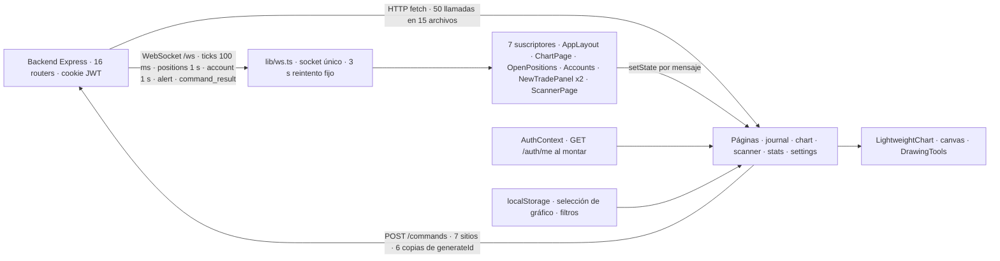
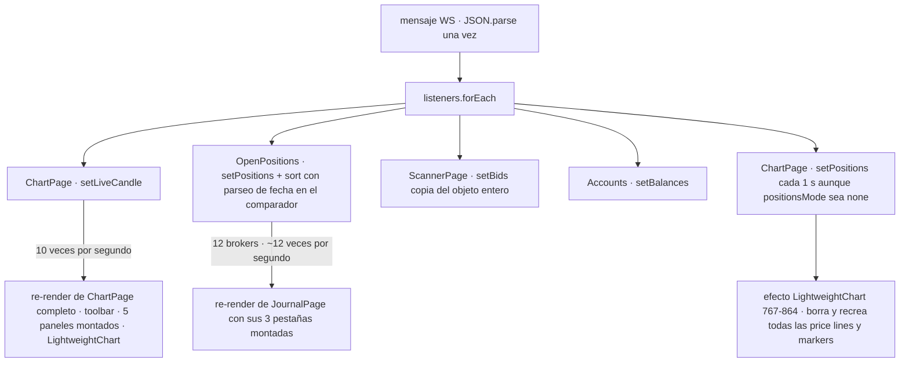
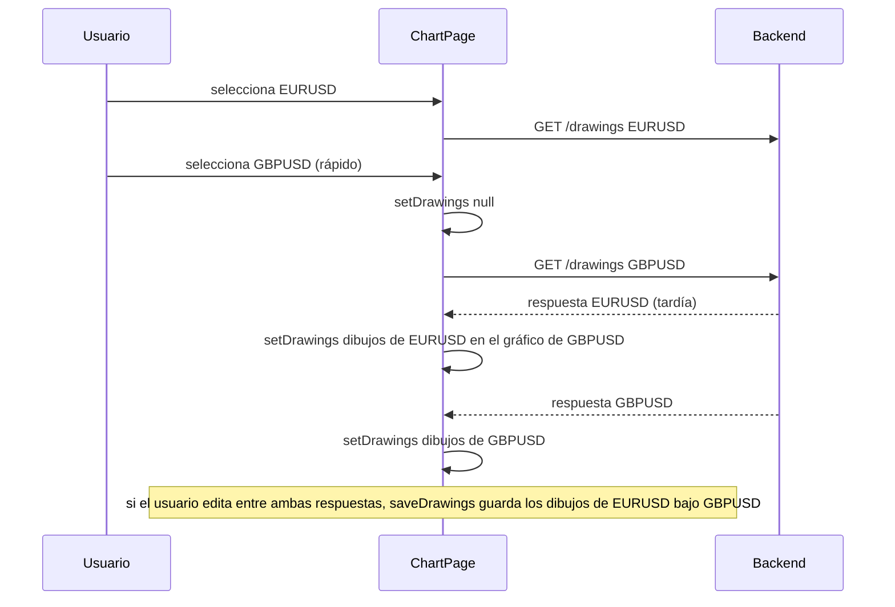
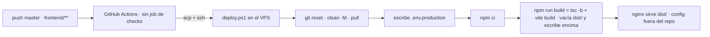

# Frontend — Estado, diagnóstico y plan de mejora

> 08/10/2026 · `master` @ `cfb5ecf` · Revisión de solo lectura: 58 archivos TS/TSX (7 926 líneas), 28 módulos CSS (4 701 líneas), 0 tests, sin build ni tests ejecutados (solo `eslint` y `tsc --noEmit` en modo lectura) · 1 SP = 1 h de desarrollador senior.
> Documento único. Cada mejora explicada sin tecnicismos: [mejoras explicadas](2026-10-08-frontend-explained.md).

---

## Parte I — Cómo funciona hoy

### 1. De dónde vienen los datos y a dónde van



Una SPA React 19 con React Router 7 (`src/app/Router.tsx`): `/login` y, bajo `ProtectedRoute` + `AppLayout`, cinco páginas (`/journal`, `/chart`, `/scanner`, `/stats`, `/settings`). **Todas se importan estáticamente** (`Router.tsx:6-10`): no hay `React.lazy`, así que `/login` descarga también `lightweight-charts` (176 KB) y `DrawingTools` (1 222 líneas). `features/dashboard/` existe pero no está enrutado: código muerto.

**Sesión.** `AuthProvider` llama a `GET /auth/me` una vez al montar (`AuthContext.tsx:22-28`); `ProtectedRoute` manda a `/login` si no hay usuario. **Un 401 en mitad de la sesión no lo gestiona nadie**: cada llamada convierte el error en lista vacía (`useAlerts.ts:30`) o ni mira `res.ok` y traga la excepción del `.map` (`ChartPage.tsx:190,205,326`, `SettingsPage.tsx:36`, `ScannerPage.tsx:197`). Tras el login se vuelve siempre a `/` (`LoginPage.tsx:21`), perdiendo el deep-link.

**WebSocket.** `lib/ws.ts` abre **un socket al importar el módulo** (`ws.ts:34`), antes del login, y nunca lo cierra; reconecta con un temporizador fijo de 3 s (`ws.ts:28`), sin backoff, sin aviso de reconexión a los consumidores (las velas perdidas durante un corte no se recuperan hasta recargar). Cada mensaje llega como `unknown` a los 7 suscriptores, que lo tipan inline cada uno (`type: string`, sin unión discriminada). El `broker` viaja en la raíz del mensaje y se inyecta en cada posición en **cuatro sitios** (`ChartPage.tsx:276-281,309-314`, `OpenPositions.tsx:63,89-94`), lo que obliga a `Position.broker` opcional y a `p.broker!` río abajo.

**HTTP.** `lib/api.ts` son cinco líneas (`apiUrl`). Las 50 llamadas repiten `credentials`, cabeceras, `res.ok` y un `as Promise<T>` que no valida nada. Solo 17 comprueban `res.ok`; hay 21 `catch` vacíos. **Ningún `AbortController`** en todo el código.

### 2. Ciclo de un tick



**Todo tick entra en estado React.** No hay store con selectores ni `React.memo` (0 usos). En `/chart`, cada batch del broker seleccionado llama a `setLiveCandle` (`ChartPage.tsx:287-293`) y re-renderiza la página entera ~10 veces/s, incluidos `AlertsPanel`, `NewTradePanel` (423 líneas), `BulkEditPanel` (recibe un array nuevo `[editPosition]` cada vez, `:501`) y `LightweightChart` (callbacks inline). Las posiciones del pipe disparan `setPositions` cada segundo aunque el modo sea `none` (`:276-283`); la lista nueva hace que el efecto de posiciones del gráfico (`LightweightChart.tsx:767-864`) **borre y recree** todas las líneas de precio y el plugin de markers, y recorra el histórico hacia atrás por posición.

### 3. El gráfico

El chart se crea una vez (`LightweightChart.tsx:516-646`) y la vela viva usa `series.update` (`:735-765`): eso está bien. Lo caro está en el **pan/zoom**: `drawRollovers` corre en cada cambio de rango visible (`:610-611`) y `snapToCandle` recorre el histórico completo creando un `Date` por vela **por cada línea de rollover** (`:416-428`): en H1 con 2 000 velas, ~80 líneas × 2 000 ≈ 160 000 `Date` por frame. Dos bucles `requestAnimationFrame` corren sin parar mientras haya posiciones/alertas (`:313-345`) o dibujos (`DrawingTools.ts:208-228`). Los canvas de overlay ignoran `devicePixelRatio` (0 usos): líneas borrosas en retina. El filtro de fin de semana está copiado 4 veces (`:416,503,597,655`).

### 4. Estado, datos compartidos y acoplamiento

- `/balances` se pide desde **7 sitios** (`useBalances`, `Accounts`, `ChartPage:187`, `ScannerPage:197`, `StatsPage:31`, `SettingsPage`, `NewTradePanel:83`); `/settings` desde 5. Abrir `/chart` lo pide dos veces (`ChartPage.tsx:156` + `useDisplaySettings`), abrir `/journal` pide `/balances` dos veces. Nada se cachea: volver a un símbolo re-descarga 2 000 velas.
- `JournalPage` monta las tres pestañas y oculta dos con CSS (`JournalPage.tsx:197-209`): `Accounts` sondea `/balances/daily-pnl` cada 5 s (`Accounts.tsx:68-78`) aunque la pestaña o el navegador estén ocultos (0 usos de `visibilitychange`).
- `features/journal/utils/position.ts` (168 líneas) es el **módulo de dominio** de toda la app — tipos `Trade`/`Position`, P&L, pips, moneda, fechas — importado por **20 archivos** de journal, chart, stats, settings y `lib/useDisplaySettings.ts` (capa `lib` importando de una feature). `NewTradePanel`, `BulkEditPanel` y `ClosePositionPanel` viven en journal pero los usa el gráfico.
- Tres caminos distintos para cerrar una posición: `OpenPositions.tsx:127-150` (manda `sl:0,tp:0`, sin feedback), `ClosePositionPanel.tsx:28-40` (sin sl/tp, toast de éxito sin mirar `res.ok`), `JournalPage.tsx:78-106`.

### 5. Las tres definiciones de pip

| Dónde | Pip | Consecuencia |
|---|---|---|
| `position.ts:133` `calcPnl` | 0.01 si el símbolo contiene `JPY`, si no 0.0001 | XAUUSD en modo "pips" sale mal |
| `LightweightChart.tsx:110,681` | 10 × `minMove` de `getPricePrecision` (JPY = 3 decimales, resto 5) | el comentario "XAUUSD 0.1" es falso: usa 0.0001 |
| Scanner y `NewTradePanel` | `pipSize` que manda el backend (`getPipSize` compartido) | la única correcta |

El journal muestra siempre 5 decimales; el gráfico 3 para JPY. Las fechas del EA (`"yyyy.mm.dd hh:mi"`) se parsean en tres sitios: `openTimeToUtcSec` (`LightweightChart.tsx:73`) y `fmtLocalTime` (`position.ts:156`) como UTC, `openTimeMs` (`position.ts:165`) como hora local (solo ordena, pero ordena distinto). Ningún `new Date(cadena del EA)` directo: **no hay crash de Safari** hoy.

### 6. El mecanismo más arriesgado: respuestas que llegan tarde



Sin cancelación, el orden de llegada decide el estado. Afecta a velas (`ChartPage.tsx:319-342`), load-more (`:370-391`, que además deja `isLoadingMoreRef` en `true` si falla y bloquea el scroll infinito hasta remontar, `LightweightChart.tsx:614/708`), símbolos (`:202-212`), dibujos (`:344-352`, **el único caso que corrompe datos**: `saveDrawings` captura broker/símbolo actuales, `:354-362`), posiciones (`OpenPositions.tsx:56-76`, el snapshot REST pisa uno más nuevo del WS), scanner (`useScanner.ts:43-57`) y trades (`ClosedPositions.tsx:23-38`). Solo tres sitios tienen bandera `cancelled` (`StatsPage.tsx:48`, `NewTradePanel.tsx:135`, `useBuildInfo.ts:20`). Añadido: al cambiar de broker nunca se re-elige símbolo (`ChartPage.tsx:208`, `if (!initSymbol)` siempre falso tras el montaje; el `eslint-disable` de `:211` lo tapa), así que un broker sin el símbolo actual deja el gráfico vacío.

### 7. Errores, toasts y límites

- `ChartErrorBoundary` solo envuelve `LightweightChart` (`ChartPage.tsx:490`) y se resetea al siguiente frame (`ChartErrorBoundary.tsx:30-33`): un error persistente se convierte en un bucle montar/romper a ~60 Hz. No hay boundary global; `BrowserRouter` declarativo no ofrece `errorElement`. Un error de render fuera del gráfico deja la pantalla en blanco.
- Un New Trade fallido muestra **dos toasts de error** (`AppLayout.tsx:30-33` y `NewTradePanel.tsx:72-73`). `SettingsPage.tsx:59-65` marca "Saved" aunque el PUT falle. Sin `catch`: `OpenPositions.confirmAndClose`, `useAlerts` create/toggle/remove, `saveEmas` (`ChartPage:174`), `logout`.
- En `AlertsPanel` se puede cambiar el broker mientras la lista de símbolos sigue siendo la del gráfico (`AlertsPanel.tsx:63,201`).

### 8. Herramientas y despliegue



- **No hay job de checks** (`deploy-frontend.yml`): el backend tiene lint + typecheck + test antes del deploy; el frontend solo tiene el `tsc -b` implícito del build. **ESLint falla hoy con 29 errores y 4 avisos** (`react-hooks/set-state-in-effect` ×18, `react-hooks/refs` ×5, `exhaustive-deps` ×4, `no-useless-escape` ×4, `no-empty` ×1, `only-export-components` ×1). Nadie lo ejecuta.
- **El build escribe en el sitio**: Vite vacía `dist/` antes de escribir, así que hay una ventana de 404 en cada deploy y un build roto deja el sitio caído; el backend resolvió esto con `dist.next`/`dist.prev` (spec 005). La config de nginx y sus cabeceras de caché no están en el repo (`CLAUDE.md:111` "por confirmar"); `index.html` y `sw.js` necesitan `no-cache`, `/assets` `immutable`.
- `strict` **sí está activo**: TypeScript 6 lo activa por defecto (`ts.getStrictOptionValue` → `true` en 6.0.3) aunque `tsconfig.app.json` no lo escriba. No hay `any` reales (los 4 son comentarios). Faltan `typecheck`/`test`, Prettier, `.nvmrc`, `engines` (el backend los tiene desde la spec 008). `@vitejs/plugin-basic-ssl` es una devDependency sin uso; `public/icons.svg` no se referencia.
- Bundle sin comprimir: react-vendor 228 KB, lightweight-charts 176 KB, app 160 KB, CSS 72 KB. Fuentes por `@import` de Google Fonts (`global.css:2`) sin `preconnect`: cadena CSS → hoja de Google → ficheros; el canvas puede pintar "DM Mono" con la fuente de reserva.

### 9. Sistema de diseño

Los tokens de `variables.css` coinciden con `CLAUDE.md` en colores, fuentes y tracking; **una discrepancia**: `--text-3xl` es 24px (`variables.css:36`) y la spec dice 28px. Las escalas de espaciado, radios, z-index, transiciones y tamaños de botón existen solo como prosa, no como tokens: de ahí la mayoría de los valores sueltos. En números: 598 líneas con `px` (132 bordes y ~260 espaciados legítimos; ~30 fuera de escala, `5px` ×9 en un mismo patrón de card); 1 sola `font-size` en px (`JournalPage:403`, 7px); z-index fuera de escala `49` ×7 (todos los backdrops), `20`, `2`/`3`, y la nav móvil a `10` cuando la spec dice 99; ~25 colores `rgba` de la paleta con alpha sin token (el hover "buy" existe en 3 intensidades y el "sell" en 4); ~45 valores hex duplicando la paleta en TS para los canvas (`LightweightChart.tsx:521-573`, `BalanceChart.tsx:13-42`, `DrawingTools.ts:104-113`), sin módulo de tema. **Sin componente `Button` ni `Input`**: ~45 clases de botón en 16 módulos (5 variantes reales), 13 definiciones de `.input`, y los **8 drawers** (`NewTrade`, `Filters`, `BulkEdit`, `ClosePosition`, `Confirm`, `Alerts`, `Indicators`, `ChartFilters`) repiten backdrop/panel/header/✕/bottom-sheet móvil (~57 líneas de CSS idénticas cada uno, ~400 en total), ninguno cierra con Escape ni declara `role="dialog"`. Spinners de `type="number"`: la regla vive en 4 módulos, no en `global.css`, y **3 inputs los siguen mostrando** (`ScannerPage.tsx:228-229`, `SettingsPage.tsx:107`); `inputMode` solo en `AlertsPanel`. iOS: `index.html:6` **no lleva `viewport-fit=cover`**, así que las 7 reglas `env(safe-area-inset-*)` pueden valer 0; pinch-zoom bloqueado (meta + `touch-action` + `main.tsx:6-8`); `100dvh` solo en `ChartPage`; sin `overscroll-behavior` en los drawers. Breakpoints 100 % en 768/769/1024.

Listas de datos (regla tabla/cards): los pares existen en journal y stats, el **scanner solo tiene tabla**; el formateo de fila y card está copiado (~14 `fmt(x,5)`, ~12 importes con moneda) y **ya ha divergido**: swap positivo verde en tabla y no en card (`OpenPositions.tsx:227` vs `PositionCard.tsx:121`, `TradeCard:54`); las cards de órdenes pendientes usan `styles.label`, **clase que no existe** en `JournalPage.module.css` (`OpenPositions.tsx:319-323`); `.btnDesktop`/`.filtersBtnDesktop`/`.newTradeBtnDesktop` se usan en JSX y no están definidas; ~150 líneas de CSS muerto en `JournalPage.module.css` (`.modal*`, `.tradeCard*`, `.header/.title/.count`).

---

## Parte II — Diagnóstico

**A. Nada frena un deploy.** El pipeline del frontend no ejecuta lint ni tests; ESLint lleva acumulados 29 errores (18 de ellos `set-state-in-effect`, que señalan exactamente los efectos que hacen `setState` al montar y duplican peticiones). El build se escribe sobre el `dist/` que nginx está sirviendo: cada deploy tiene su ventana de 404 y un build roto deja la app caída, cuando el backend ya tiene swap atómico y rollback desde la spec 005.

**B. Los errores se tragan.** 21 `catch` vacíos, 33 de 50 `fetch` sin mirar `res.ok`. Las consecuencias visibles: cerrar una posición muestra "Close sent" aunque el backend responda 4xx/5xx (`ClosePositionPanel.tsx:28-40`) o no dice nada (`OpenPositions.tsx:131`); Settings marca "Saved" tras un PUT fallido (`SettingsPage.tsx:59-65`); un 401 de sesión caducada se ve como "no hay alertas / no hay símbolos" en vez de mandar al login; un New Trade fallido avisa dos veces. Sin boundary global ni `unhandledrejection`: un error de render fuera del gráfico deja la pantalla en blanco, y dentro del gráfico entra en bucle de remontaje.

**C. Las respuestas tardías mandan.** 0 `AbortController`, 3 banderas `cancelled` en 50 llamadas. Cambiar de símbolo rápido puede pintar las velas o los dibujos del símbolo anterior; con los dibujos, la siguiente edición los **guarda bajo el símbolo equivocado**. Un load-more fallido bloquea el scroll infinito hasta recargar. Al cambiar de broker, el símbolo nunca se re-elige (`ChartPage.tsx:208`).

**D. Cada tick re-renderiza páginas enteras.** Sin store, sin selectores, sin `React.memo`: `/chart` se vuelve a renderizar ~10 veces/s con sus cinco paneles montados; las posiciones recrean todas las price lines y markers cada segundo aunque el modo sea `none`; el journal se re-renderiza ~12 veces/s con sus tres pestañas, ordenando con un parseo de fecha dentro del comparador; el scanner copia el objeto de bids entero por tick. En pan/zoom, ~160 000 `Date` por frame en H1. Dos bucles rAF permanentes y canvas sin `devicePixelRatio`.

**E. Datos repetidos y capas invertidas.** `/balances` desde 7 sitios y `/settings` desde 5, sin caché ni invalidación tras guardar Settings; un poll de 5 s que no se detiene con la pestaña oculta. El módulo de dominio (`position.ts`, 20 importadores) vive dentro de `features/journal` y `lib` lo importa; tres paneles de trading viven en journal y los usa el gráfico; el WS se tipa inline 7 veces y el `broker` se inyecta en 4. Seis copias de `generateId`, tres caminos para cerrar una posición con payloads distintos.

**F. UI duplicada que ya diverge.** 8 drawers con el mismo shell copiado (~400 líneas) y sin Escape/`role=dialog`; ~45 clases de botón, 13 `.input`; filas y cards con el formateo copiado y tres inconsistencias ya visibles (swap sin color, `styles.label` inexistente, clases `*Desktop` sin definir); tres definiciones de pip (XAUUSD mal en modo pips), dos precisiones de precio, `TIMEFRAMES` ×4, selector de broker ×8, código muerto (`DashboardPage`, ~150 líneas de CSS, `PNL_MODES`, `resetFeedback`, `plugin-basic-ssl`).

**G. Sistema de diseño sin tokens de escala, iOS a medias, cero tests.** Tokens de color/fuente correctos salvo `--text-3xl`; escalas de espaciado/z-index/radio/transición solo en prosa, de ahí backdrops a `z-index: 49`, nav móvil a 10 (spec 99), hovers con alpha en 7 intensidades, ~45 hex en TS; spinners sin quitar en 3 inputs numéricos (regla explícita del usuario); `viewport-fit=cover` ausente (safe-areas posiblemente inertes); 0 tests sobre P&L, pips, rangos de fechas ni geometría de dibujos; sin `typecheck`/`test`/Prettier/`.nvmrc` que el backend ya tiene.

---

## Parte III — Qué proponemos

### 10. Mejoras, en orden de valor por hora

| Código | Mejora | Qué resuelve | SP | Spec |
|---|---|---|---|---|
| FE-01 | Gate de CI (lint + `tsc -b` + test, el deploy depende de él) con ESLint en verde; `res.ok` + `catch` en comandos de cierre, Settings, alertas y logout; un solo toast de error; boundary global + `unhandledrejection`; tope de reintentos en `ChartErrorBoundary`; `styles.label` y clases `*Desktop` | A, B | 4 | — |
| FE-02 | Cancelación de respuestas obsoletas (`AbortController` o clave de petición) en velas, load-more, símbolos, dibujos, posiciones, scanner y trades; reset de `isLoadingMoreRef`; re-elección de símbolo al cambiar broker | C | 2 | — |
| FE-03 | `apiFetch<T>()` (credentials, JSON, lanza en no-OK, 401 → `setUser(null)`); `lib/commands.ts` con `sendCommand` + `newCommandId` para los 7 POST; `useRemoteList` para alertas; volver al deep-link tras login | B, E | 3 | — |
| FE-04 | Render por tick: `liveCandle` fuera del estado de página (ref + `series.update` o store con `useSyncExternalStore`), precio al `AlertsPanel` solo abierto; posiciones solo si cambian y `applyOptions` en vez de recrear; bids del scanner por rAF y limpiados al cambiar broker; journal con tiempos precalculados y opciones solo si cambian; `React.memo` en paneles; poll de daily-pnl pausado con pestaña oculta | D, E | 5 | — |
| FE-05 | Datos compartidos: provider/caché (balances, settings, symbols) con invalidación al guardar Settings; `useLivePositions` común a chart y journal; `ws.types.ts` con unión discriminada + `useWsMessage(type)` + `normalizePositions` una sola vez; `Position.broker` obligatorio; WS conectado tras auth, cerrado en logout, backoff con jitter y evento de reconexión que refresca | E, C | 4 | — |
| FE-06 | Deploy atómico (`dist.next` → swap, conservar assets viejos) y config de nginx en `infra/` con `no-cache` para `index.html`/`sw.js` e `immutable` para `/assets`; `React.lazy` por ruta; `preconnect` o fuentes autoalojadas; quitar `plugin-basic-ssl` e `icons.svg`; `.nvmrc`, `engines`, `strict` explícito | A, G | 3 | — |
| FE-07 | `SidePanel` compartido (backdrop, header, ✕, Escape, `role="dialog"`, bottom sheet móvil, `overscroll-behavior`) + `panel.module.css`, aplicado a los 8 drawers | F | 4 | — |
| FE-08 | Globales del sistema de diseño: spinners en `global.css` + `inputMode` en los 11 inputs; `viewport-fit=cover` (validar en iPhone); `--text-3xl`; tokens de alpha (`--green-a15`, `--red-a15`, `--orange-a12`, `--overlay`, `--hover-row`) y de z-index; `chart/theme.ts` para los canvas; scrollbar Firefox; cursor inline → clases; durations 0.15/0.18 → escala | G | 3 | — |
| FE-09 | Dominio compartido: `position.ts`/`dateRange.ts` a `src/shared/domain/`; formateadores únicos (`fmtPrice`, `fmtMoney`, `fmtSigned`, `fmtPips`) y **una** `pipSize`/`pricePrecision` (decidir XAUUSD con el usuario); parser único de fechas del EA; arreglar swap/filtro de tipo; borrar `DashboardPage`, CSS muerto, `PNL_MODES`, `resetFeedback`; paneles de trading a `features/trading/` | F, E | 4 | — |
| FE-10 | Vitest + primeros tests puros: `calcPnl`/`fmtPnlMode` (4 modos × lado × JPY), `fmtLocalTime`/`openTimeMs`, `projectToPrice`, presets de `dateRange`, `useSort`; scripts `typecheck`/`test`, Prettier con la config del backend | G, base de FE-11/12 | 3 | — |
| FE-11 | Partir `ChartPage` en hooks (`useChartSelection`, `useFullscreen`, `useCandles`, `useDrawings`, `useChartPrefs`) y `LightweightChart` en `chartMath.ts` (con un `filterWeekend` testeado), `chartTheme.ts`, `useEmaSeries`, `useOverlayCanvas`, `usePositionLevels`, `useLevelDrag`, `ChartLegend`/`ChartActions`; caché de rollovers + búsqueda binaria; `devicePixelRatio` en canvas; rAF solo cuando cambia algo | D, F | 8 | — |
| FE-12 | Primitivas UI (`Button` sm/md/lg × variantes, `Input`/`Select`, `BrokerSelect`, `TimeframeSelect`, `DateRangeFields`, `TIMEFRAMES` único) y `DataList` + `ExpandableCard` (definición de columnas que alimenta tabla y cards, `useDoubleTap`, scanner móvil); partir `DrawingTools` en tipos/persistencia/hit-test/input/painters con tests previos | F, G | 10 | — |

**Bloque recomendado (primero): FE-01 + FE-02 + FE-03 = 9 SP (~1 día y medio).** Pone un gate delante del deploy, convierte los fallos silenciosos en errores visibles y cierra el único hallazgo que corrompe datos (dibujos bajo el símbolo equivocado). Condición: comparar con producción antes/después que los comandos de cierre y Settings informan ahora del error.

**Segundo bloque: FE-04 + FE-05 + FE-06 = 12 SP.** Rendimiento por tick, datos compartidos, deploy atómico y carga por ruta.

**Tercero: FE-07 … FE-10 = 14 SP.** Shell de panel, tokens globales, dominio compartido y tests — la base que hace seguros FE-11 y FE-12.

**Cuarto (refactors grandes): FE-11 + FE-12 = 18 SP**, por partes y solo tras FE-10.

### 11. Refactors clave

**Capa de red (FE-03).** `src/lib/api.ts`:

```ts
let onUnauthorized: (() => void) | null = null;
export const setUnauthorizedHandler = (fn: () => void) => { onUnauthorized = fn; };

export async function apiFetch<T>(path: string, init: RequestInit & { signal?: AbortSignal } = {}): Promise<T> {
  const res = await fetch(apiUrl(path), { credentials: 'include', ...init,
    headers: { ...(init.body ? { 'Content-Type': 'application/json' } : {}), ...init.headers } });
  if (res.status === 401) { onUnauthorized?.(); throw new ApiError(401, 'Unauthorized'); }
  if (!res.ok) throw new ApiError(res.status, await errorText(res));
  return res.status === 204 ? (undefined as T) : (res.json() as Promise<T>);
}
```

`AuthProvider` registra `setUser(null)` y `ProtectedRoute` guarda `location` para volver tras el login. `lib/commands.ts` expone `newCommandId()` y `sendCommand(cmd)` que devuelve el `id` y lanza en error; los 7 llamadores dejan de construir el POST y de generar ids. Pasos: 1) `apiFetch` + `ApiError`; 2) migrar los 7 comandos y Settings (los que hoy mienten); 3) migrar el resto por archivo; 4) borrar `generateId` ×6.

**Cancelación (FE-02).** Patrón único: `const ac = new AbortController(); apiFetch(path, { signal: ac.signal })…; return () => ac.abort();` en cada efecto de carga; en load-more, descartar el resultado si `(broker, symbol, timeframe)` cambió y resetear `isLoadingMoreRef` en `finally` y al reemplazar velas. Verificación: con throttling de red, cambiar de símbolo tres veces seguidas y comprobar que el gráfico y los dibujos son los del último.

**Tick fuera del estado (FE-04).** `ChartPage` deja de tener `liveCandle` en `useState`: el handler del WS escribe en un `liveCandleRef` y llama a `chartApi.current?.updateLive(candle)` (método expuesto por `LightweightChart` vía `useImperativeHandle`) que hace `series.update`; `AlertsPanel` recibe `currentPrice` solo cuando `open`. Para posiciones: comparar firma `(ticket, sl, tp, profit)` antes de `setPositions`; en el efecto de niveles, mantener un `Map<ticket, IPriceLine>` y `applyOptions` sobre la existente. Scanner: acumular bids en un ref y volcar en `requestAnimationFrame` si cambió algún valor. Journal: `openTimeMs` precalculado al recibir, `setOpenOptions` solo si el conjunto difiere. Medida: React Profiler antes/después, renders de `ChartPage` por segundo con el gráfico quieto (hoy ~10, objetivo 0).

**Datos compartidos (FE-05).** `ReferenceDataProvider` en `AppLayout` con `brokers`, `balances`, `settings`, `symbolsByBroker` y `refresh(key)`; una promesa en vuelo por clave (dedupe). `useLivePositions(broker?)` suscribe al WS, normaliza (`broker` en cada item) y mezcla con el snapshot REST inicial sin que éste pise uno más nuevo (comparar `receivedAt`). `ws.ts`: `connect()` explícito desde `AuthProvider` al tener usuario, `disconnect()` en logout, backoff `min(30 s, 1 s × 2ⁿ) + jitter`, evento `open` que los consumidores usan para refrescar.

**Shell de panel (FE-07).** `<SidePanel open onClose title width?>` con backdrop, cabecera, ✕, `role="dialog"` + `aria-modal`, Escape, foco al abrir, bottom-sheet en móvil y `overscroll-behavior: contain`; `panel.module.css` único. Migrar los 8 drawers uno a uno comparando capturas; el de alertas conserva sus 340 px por prop.

**Dominio (FE-09).** `src/shared/domain/{position,dateRange,format,pip,eaDate}.ts`. Decisión del usuario: `pipSize(symbol)` por tabla (`JPY` → 0.01, `XAU` → 0.1 o 0.01 según broker, resto 0.0001) o siempre el `pipSize` del backend (el gráfico y el journal tendrían que pedirlo). Con una sola fuente, filas y cards comparten `render` y no vuelven a divergir.

### 12. Qué no proponemos ahora, y qué lo haría entrar

- **Gestor de estado externo (Zustand, Redux) o React Query.** El stack dice no ampliar sin necesidad; `useSyncExternalStore` + un provider cubren FE-04/05. Entraría si tras FE-05 siguieran apareciendo cachés a mano en tres o más sitios.
- **Virtualización de tablas.** Las listas son de decenas de filas (12 brokers, cientos de trades como mucho con paginación de 200). Entraría con el histórico completo sin paginar.
- **Tests de componentes (Testing Library) y E2E.** Primero los puros (FE-10); los de componentes tras FE-07/FE-12, cuando existan primitivas que merezcan test.
- **Self-host de fuentes como obligatorio.** `preconnect` basta; autoalojar entraría si se mide FOUT en el canvas en producción.
- **PWA con caché offline.** `sw.js` solo hace push; cachear `index.html` sin estrategia de versiones rompería los deploys. Entraría con FE-06 cerrado y una política de versionado.
- **Migrar `DrawingTools` a React.** Es una clase imperativa sobre canvas que funciona; partirla en módulos (FE-12) es suficiente.

### 13. Cómo sabremos que ha servido

- Pipeline: `lint`, `typecheck`, `test` en verde en cada push y el deploy bloqueado si fallan; 0 ventana de 404 (curl en bucle durante un deploy).
- Errores: cerrar una posición con el backend parado muestra un error, no "Close sent"; Settings con el backend parado no dice "Saved"; sesión caducada → login en < 1 s.
- Velas/dibujos: tres cambios de símbolo en 1 s con red lenta → gráfico y dibujos del último; `GET /drawings` del símbolo anterior no cambia tras la prueba.
- Render: React Profiler con el gráfico quieto → 0 renders/s de `ChartPage` (hoy ~10); journal con 12 brokers → 0 renders/s de `JournalPage` (hoy ~12); pan en H1 sin caídas de frame.
- Red: abrir `/journal` → 1 `GET /balances`; `/chart` → 1 `GET /settings`; pestaña oculta → 0 polls.
- Sistema de diseño: 0 inputs numéricos con spinner; `grep -c "z-index: 49"` = 0; `--text-3xl` igual en spec y código; safe-areas visibles en iPhone con notch.
- Tests: `calcPnl` cubierto en los 4 modos; tamaño del bundle inicial sin `lightweight-charts`.

### 14. Base de la estimación

Calibrado con las specs cerradas del backend (`archive/2026-09` y `2026-10`): 007 BE-04 estimada 6.5 SP / real 5.25; 013 BE-07 2/2; 014 BE-09 1.75/2; 015 BE-10 4/3. Las tareas con arnés de medida cuestan ~1 SP cada una y las de documentación/mecánicas salen por debajo. Aquí no hay tests previos ni arnés: FE-01 incluye 1 SP para dejar ESLint en verde (29 errores, la mayoría `set-state-in-effect` que se resuelven moviendo la carga inicial a `useEffect` con cancelación o a los hooks de FE-05). FE-11 y FE-12 son refactors de archivos de 1 000+ líneas sin tests: se estiman con margen y se condicionan a FE-10. **Recomendación:** abrir FE-01, FE-02 y FE-03 como specs con `/amfx-spec-new` en ese orden; FE-02 puede ir antes que FE-01 si se quiere cerrar primero la corrupción de dibujos.

### 15. Qué esperar al terminar

Tras los dos primeros bloques (21 SP): ningún deploy sale sin lint/typecheck/test, ningún comando miente sobre su resultado, la sesión caducada lleva al login, un cambio de símbolo nunca mezcla datos, el gráfico y el journal dejan de re-renderizarse por tick, cada dato de referencia se pide una vez y el deploy es atómico. Tras el tercero (35 SP): un solo shell de panel, tokens para todo lo que la spec describe, un módulo de dominio con una sola definición de pip y tests sobre el P&L. Los refactors grandes (FE-11/12) reducen `ChartPage`/`LightweightChart`/`DrawingTools` a piezas de < 300 líneas testeables y dejan la regla tabla/cards implementada una vez.

---

## Anexo A — Referencias por hallazgo

| Diagnóstico | Referencias |
|---|---|
| A · pipeline y deploy | `.github/workflows/deploy-frontend.yml` (sin job de checks) · `frontend/scripts/deploy.ps1:12-21` · `vite.config.ts:26-33` · ESLint 29 errores (`npx eslint .`) · `backend/scripts/deploy.ps1:97-137` (swap/rollback de referencia) |
| B · errores tragados | `ClosePositionPanel.tsx:28-41` · `OpenPositions.tsx:127-150` · `SettingsPage.tsx:56-65` · `BulkEditPanel.tsx:31-48` · `JournalPage.tsx:82-99` · `ChartPage.tsx:190,205,326,414-428` · `useAlerts.ts:30` · `AuthContext.tsx:45-48` · `AppLayout.tsx:23-35` + `NewTradePanel.tsx:72-73` · `ChartErrorBoundary.tsx:30-33` · `ColorBadge.tsx:18` |
| C · respuestas tardías | `ChartPage.tsx:202-212,319-342,344-362,370-391` · `LightweightChart.tsx:614,708` · `OpenPositions.tsx:56-76` · `useScanner.ts:43-57` · `ClosedPositions.tsx:23-38` · banderas existentes `StatsPage.tsx:48`, `NewTradePanel.tsx:135`, `useBuildInfo.ts:20` |
| D · render por tick | `ChartPage.tsx:276-293,394-400,501` · `LightweightChart.tsx:313-345,416-428,581-589,610-611,624-628,767-864` · `DrawingTools.ts:208-228` · `ScannerPage.tsx:148,181-189` · `OpenPositions.tsx:76-81,94-98` · `JournalPage.tsx:197-209` · `Accounts.tsx:65-78` |
| E · datos y capas | `/balances`: `useBalances.ts:12`, `Accounts.tsx:56`, `ChartPage.tsx:187`, `ScannerPage.tsx:197`, `StatsPage.tsx:31`, `SettingsPage.tsx`, `NewTradePanel.tsx:83` · `/settings`: `ChartPage.tsx:156` + `useDisplaySettings` · `lib/useDisplaySettings.ts:3` · `SettingsPage.tsx:4` · `position.ts:21` · `generateId`: `OpenPositions:34`, `NewTradePanel:38`, `JournalPage:24`, `ClosePositionPanel:13`, `BulkEditPanel:13`, `ChartPage:419` · `ws.ts:5,28,34` |
| F · duplicación | drawers: `NewTradePanel.tsx:236-241`, `FiltersPanel:41-46`, `BulkEditPanel:59-64`, `ClosePositionPanel:52-57`, `ConfirmPanel:17-22`, `AlertsPanel:82-87`, `IndicatorsPanel:106-111`, `ChartFiltersPanel:21-26` · `OpenPositions.tsx:227` vs `PositionCard.tsx:121` · `OpenPositions.tsx:319-323` (`styles.label`) · `JournalPage.tsx:139-162` (`*Desktop`) · `JournalPage.module.css:159-181,274-365,550-589` · pips: `position.ts:133`, `LightweightChart.tsx:110,681` · `TIMEFRAMES`: `NewTradePanel:25`, `AlertsPanel:7`, `ScannerPage:8`, `ChartToolbar:5` · `features/dashboard/` |
| G · diseño, iOS, tests | `variables.css:36` vs `CLAUDE.md` (`--text-3xl`) · `index.html:6` · `global.css` (sin regla de spinner) · `ScannerPage.tsx:228-229`, `SettingsPage.tsx:107` · z-index 49 ×7, `ChartPage.module.css:45`, `AppLayout.module.css:204` · `LightweightChart.tsx:521-573`, `BalanceChart.tsx:13-42`, `DrawingTools.ts:104-113` · `global.css:2` (fuentes) · `tsconfig.app.json`, `package.json` (sin `typecheck`/`test`) · `backend/package.json`, `backend/.nvmrc` (referencia) |

## Anexo B — Detalle de cada mejora

**FE-01 Gate y errores visibles.** *Problema:* nada ejecuta lint; 29 errores; comandos y Settings informan éxito en fallo; sin boundary global. *Cambio:* job `check` (`npm ci`, `lint`, `tsc -b`, `test`) del que depende `deploy`; corregir los 29 errores (los `set-state-in-effect` migrando cargas iniciales a efectos con cancelación); `res.ok` + `catch` con toast en `ClosePositionPanel`, `OpenPositions.confirmAndClose`, `BulkEditPanel`, `JournalPage`, `SettingsPage`, `useAlerts`, `ColorBadge`, `logout`; quitar el toast de `NewTradePanel:72`; `ErrorBoundary` en `Router` + `window.addEventListener('unhandledrejection')` → toast; contador de reintentos en `ChartErrorBoundary`; definir `.label` y `*Desktop` o quitar su uso. *Verificación:* CI rojo con un error de lint inyectado; backend parado → toasts de error; `pm2`/consola limpias. *Riesgo:* bajo; cambia silencio por error visible.

**FE-02 Cancelación.** *Problema:* 0 `AbortController`; dibujos del símbolo anterior guardables bajo el nuevo. *Cambio:* `AbortController` por efecto de carga (velas, load-more, símbolos, dibujos, posiciones, scanner, trades); `isLoadingMoreRef` en `finally`; `if (!list.includes(symbol))` al cambiar broker. *Verificación:* throttling + tres cambios de símbolo; `GET /drawings` antes/después igual. *Riesgo:* bajo.

**FE-03 Capa de red.** *Problema:* 50 `fetch` a mano, 401 invisible, 6 `generateId`, 3 payloads de cierre. *Cambio:* `apiFetch<T>`, `ApiError`, `setUnauthorizedHandler`; `lib/commands.ts`; `useRemoteList(endpoint)` para alertas y EMA alerts; `ProtectedRoute` guarda `location`. *Verificación:* borrar la cookie en DevTools → login en la siguiente llamada; un solo `POST /commands` por acción con payload idéntico en los tres cierres. *Riesgo:* medio (toca 50 sitios; migrar por archivo).

**FE-04 Render por tick.** *Problema:* `setLiveCandle` 10/s re-renderiza `/chart`; posiciones recrean líneas 1/s; scanner y journal 10-12/s. *Cambio:* `liveCandleRef` + `updateLive` imperativo; firma de posiciones; `Map<ticket, IPriceLine>` + `applyOptions`; rAF batch en scanner; `openTimeMs` precalculado; `React.memo` en paneles con props estables; `document.hidden` en el poll. *Verificación:* React Profiler 0 renders/s en reposo; CPU en pan/zoom. *Riesgo:* medio (orden de efectos con refs).

**FE-05 Datos compartidos y WS.** *Problema:* 7 + 5 peticiones repetidas; WS sin tipos, abierto sin sesión, sin backoff ni resync. *Cambio:* `ReferenceDataProvider`, `useLivePositions`, `ws.types.ts`, `useWsMessage`, `connect/disconnect` ligados a auth, backoff con jitter, evento `open` → refresh. *Verificación:* Network: 1 petición por recurso al abrir cada página; cortar el backend 1 min → al volver, velas y posiciones al día sin recargar. *Riesgo:* medio.

**FE-06 Deploy y carga.** *Problema:* build in-place, nginx fuera del repo, sin lazy, fuentes encadenadas. *Cambio:* `deploy.ps1` con `dist.next` → swap (y `dist.prev`), `infra/nginx/frontend.conf` versionado con cabeceras, `React.lazy` + `Suspense` por ruta, `<link rel="preconnect">`, limpiar devDeps y assets, `.nvmrc`/`engines`/`strict`. *Verificación:* curl en bucle durante el deploy sin 404; Lighthouse: bundle inicial sin `lightweight-charts`. *Riesgo:* bajo.

**FE-07 Shell de panel.** *Problema:* 8 copias de backdrop/header/✕/bottom-sheet, sin Escape ni `role`. *Cambio:* `<SidePanel>` + `panel.module.css`; migración uno a uno. *Verificación:* capturas antes/después por panel; Escape cierra; lector de pantalla anuncia diálogo. *Riesgo:* medio (visual).

**FE-08 Globales de diseño.** *Problema:* spinners en 3 inputs, `viewport-fit` ausente, `--text-3xl`, alphas y z-index sin token, paleta duplicada en TS. *Cambio:* reglas globales de spinner, `inputMode`, meta viewport, tokens nuevos en `variables.css` y en la sección de diseño de `CLAUDE.md`, `chart/theme.ts`, `scrollbar-color`, clases en vez de `cursor` inline. *Verificación:* grep de valores; iPhone con notch; capturas. *Riesgo:* bajo-medio (z-index).

**FE-09 Dominio compartido.** *Problema:* dominio dentro de journal, 3 pips, formateo copiado y divergido, código muerto. *Cambio:* `shared/domain/`, `format.ts`, `pip.ts` (decisión XAUUSD), `eaDate.ts`, borrar muerto, `features/trading/`. *Verificación:* tests de FE-10 sobre el módulo movido; capturas de filas vs cards; grep de exports sin uso. *Riesgo:* medio si cambia la definición de pip (números en pantalla).

**FE-10 Tests y herramientas.** *Problema:* 0 tests; scripts y Prettier distintos del backend. *Cambio:* `vitest`, `test`/`typecheck`, `.prettierrc` del backend, tests puros listados. *Verificación:* `npm test` verde y en CI. *Riesgo:* ninguno en runtime.

**FE-11 Partir el gráfico.** *Problema:* 513 + 1 095 líneas, 78 hooks, 4 copias del filtro de fin de semana, O(líneas × n) por frame, canvas borroso. *Cambio:* hooks y módulos listados; caché + búsqueda binaria; DPR; rAF condicional. *Verificación:* tests de `chartMath`; comparación visual; Profiler. *Riesgo:* medio-alto (refs y timing); solo tras FE-10.

**FE-12 Primitivas y listas.** *Problema:* 45 botones, 13 inputs, tabla/cards duplicadas, scanner sin móvil, `DrawingTools` monolítico. *Cambio:* `Button`/`Input`/`Select`/selectores, `DataList`/`ExpandableCard`, split de `DrawingTools` con tests de persistencia e hit-test antes. *Verificación:* capturas por página; tests. *Riesgo:* medio; por etapas.

## Glosario

- **AbortController** — objeto del navegador que permite cancelar una petición `fetch` en curso; sin él la respuesta llega aunque ya no interese.
- **Backoff con jitter** — espera creciente entre reintentos de conexión con una parte aleatoria para no sincronizar a todos los clientes.
- **Boundary (ErrorBoundary)** — componente React que captura un error de render de sus hijos y muestra algo en su lugar en vez de dejar la pantalla en blanco.
- **devicePixelRatio** — píxeles físicos por píxel CSS; un canvas que lo ignora se ve borroso en pantallas retina.
- **Drawer / SidePanel** — panel lateral (o inferior en móvil) con fondo oscurecido que se abre sobre la página.
- **Gate de CI** — paso del pipeline (lint, typecheck, test) que debe pasar antes de desplegar.
- **Hook** — función React (`useX`) que encapsula estado o efectos reutilizables.
- **Pip** — unidad mínima de variación de precio usada para medir distancias; depende del instrumento.
- **rAF (requestAnimationFrame)** — callback que el navegador ejecuta una vez por frame; un bucle rAF permanente consume CPU y batería aunque no cambie nada.
- **Re-render** — React vuelve a ejecutar la función de un componente para calcular la nueva UI; con muchos por segundo, la app se vuelve lenta.
- **Respuesta obsoleta (stale)** — respuesta de una petición lanzada antes que otra y que llega después, pisando datos más nuevos.
- **Swap atómico** — construir en una carpeta aparte y cambiar el nombre al final, de modo que el servidor nunca sirva una carpeta a medio escribir.
- **Token (de diseño)** — variable CSS con nombre (`--orange`, `--text-sm`) que sustituye a un valor literal para que todo el proyecto comparta la misma escala.
- **useSyncExternalStore** — hook de React para leer un store externo y re-renderizar solo a quien lo lee.
